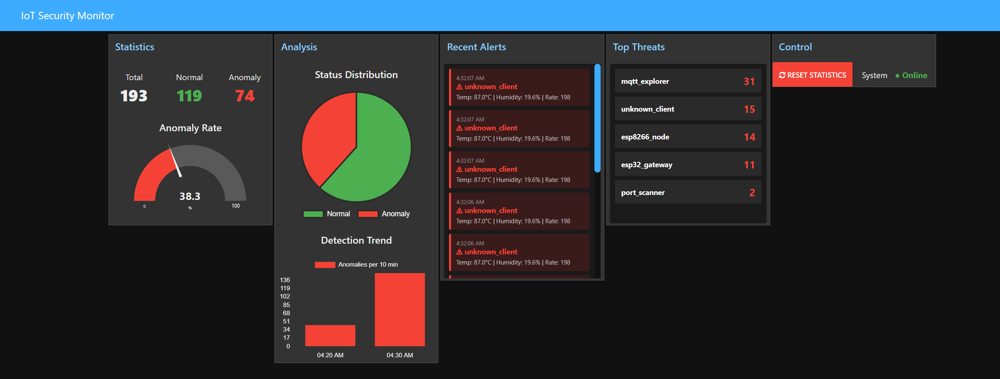
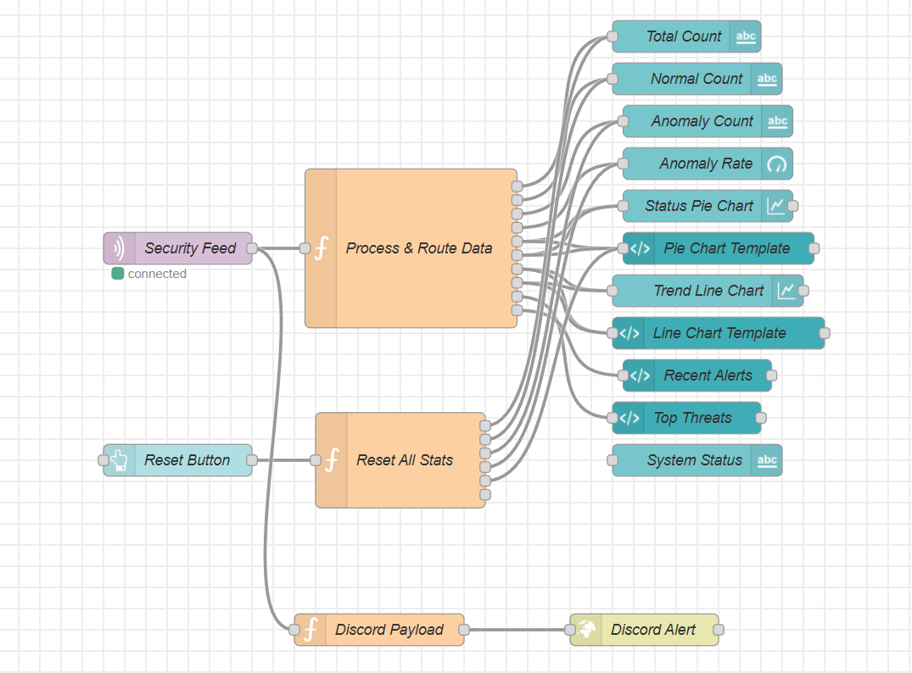

# IoT Security Anomaly Detection System

A simple IoT security monitoring project that detects attacks using Machine Learning.

## What This Project Does

- Simulates IoT devices sending sensor data (temperature, humidity, message rate)
- Detects abnormal/attack patterns automatically using ML
- Shows real-time alerts on a dashboard
- Logs everything to CSV files

## Quick Setup

### Install Requirements
```bash
pip install -r requirements.txt
```

### Install MQTT & Node-RED
```bash
# Ubuntu/Debian
sudo apt-get install mosquitto mosquitto-clients

# macOS
brew install mosquitto

npm install -g node-red
```

## How to Run

Open 5 terminals and run these in order:

**Terminal 1:**
```bash
mosquitto -v
```

**Terminal 2:**
```bash
cd runtime
python attack_simulator.py
```

**Terminal 3:**
```bash
cd runtime
python mqtt_collector.py
```

**Terminal 4:**
```bash
cd runtime
python security_monitor.py
```

**Terminal 5:**
```bash
node-red
# Open: http://localhost:1880/ui
```

## Project Structure

```
iot-security-anomaly-detection/
├── data/
│   ├── iot_dataset.csv          # Training data
│   └── sensor_log.csv           # Logs (auto-created)
├── model/
│   └── anomaly_model.pkl        # Trained model
├── notebooks/
│   ├── prepare_dataset.ipynb    # Generate data
│   └── train_model.ipynb        # Train model
├── runtime/
│   ├── attack_simulator.py      # Fake IoT traffic
│   ├── mqtt_collector.py        # Save to CSV
│   ├── prediction.py            # ML model
│   └── security_monitor.py      # Main monitoring
├── dashboard/
│   └── IoT_Security.json        # Dashboard config
├── README.md
└── requirements.txt
```

## Dashboard Preview

### Live Monitoring Dashboard


Shows:
- Total messages processed
- How many were normal vs anomaly
- Anomaly detection rate
- Recent alerts
- Suspicious devices

### Node-RED Setup


How data flows through the system to the dashboard.

## What Each Component Does

### attack_simulator.py
Sends fake sensor data to MQTT
- 90% normal messages
- 10% attack messages

### mqtt_collector.py
Saves all messages to CSV file

### prediction.py
Uses machine learning to check if data is normal or attack
- Uses One-Class SVM model
- Returns 0 = normal, 1 = attack

### security_monitor.py
Main program that:
1. Reads new data from CSV
2. Runs prediction
3. Sends alerts
4. Updates dashboard

## Training the Model

First time only:
```bash
cd notebooks
jupyter notebook prepare_dataset.ipynb
jupyter notebook train_model.ipynb
```

This creates:
- `iot_dataset.csv` - Training data (10,000 samples)
- `anomaly_model.pkl` - Trained ML model

## How It Works

```
Attack Simulator
    ↓
MQTT Broker
    ↓
Collector (CSV)
    ↓
Security Monitor reads CSV
    ↓
ML Model predicts normal/attack
    ↓
Alert to Dashboard
    ↓
You see it!
```

## What It Detects

- **High Temperature**: temp > 90°C (not normal)
- **Low Humidity**: humidity < 20% (not normal)
- **Too Many Messages**: rate > 100 msg/sec (flooding/attack)
- **Unknown Devices**: Unauthorized client IDs

## Model Performance

- Accuracy: 92%
- Catches 95% of attacks
- Only 5-10% false alarms

## Troubleshooting

### MQTT won't connect
```bash
sudo systemctl start mosquitto
```

### Model not found
```bash
cd notebooks
jupyter notebook train_model.ipynb
```

### Permission error
```bash
chmod -R 755 data/
chmod -R 755 model/
```

## Learning

This project teaches:
- MQTT protocol (IoT messaging)
- Machine Learning basics (isolation forest)
- Real-time data processing
- Dashboard visualization

## Try These Ideas

```python
# In attack_simulator.py:
# Change attack ratio
is_attack = random.random() < 0.20  # More attacks

# Change temperature range
temp = random.uniform(70, 130)  # Different range

# In security_monitor.py:
# Check more frequently
time.sleep(1)  # Instead of 2 seconds

# In Node-RED:
# Add email alerts
# Create custom charts
# Change colors
```

## Expected Output

When running correctly:

```
[14:05:30] Processing rows 0 to 10 (11 new rows)
   Predictions: 9 normal, 2 anomaly

*** ALERT: 2 anomalies detected! ***
      Alert: T=110.2 H=10.0 R=180 | mqtt_explorer
      Alert: T=95.5 H=15.0 R=120 | port_scanner
```

Dashboard shows:
- Total: 150
- Normal: 135 ✅
- Anomaly: 15 ⚠️
- Rate: 10%

## Key Concepts

**Anomaly Detection**: System learns what's "normal" then flags anything weird

**MQTT**: Simple messaging protocol used for IoT

**Isolation Forest**: an unsupervised machine learning algorithm designed specifically for anomaly detection (outlier detection) in datasets

**Real-time**: Data is processed instantly as it arrives

## Notes

- This is for learning/testing - not production
- Attack simulator is fake - real attacks look different
- Dashboard updates every 2 seconds
- CSV file grows as data is collected

## Tools Used

- Python (main language)
- MQTT (messaging)
- scikit-learn (machine learning)
- Node-RED (dashboard)
- Mosquitto (MQTT broker)

## That's It!

This is a simple learning project to understand IoT security monitoring. Feel free to modify, experiment, and learn! 
